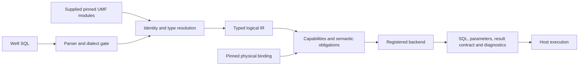

---
ddx:
  id: weft.architecture
  type: architecture
  activity: design
  status: draft
  authoring:
    home: repo
  links:
    - id: weft.prd
      kind: informed_by
---

# Weft architecture

## Scope

Weft owns a universal UMF-powered SQL dialect, a typed logical intermediate
representation (IR), capability checks, compiled artifacts and language bindings.
It is an independent UMF consumer. First targets: Ashlar/Databricks and
Truss/PostgreSQL. A third synthetic backend is required to prove extensibility.

## System Context

| Participant | Responsibility |
| --- | --- |
| UMF | Versioned metamodel, identity/type/relationship meaning, schemas and conformance fixtures |
| Weft frontend | Source dialect, name/type resolution, typed relational meaning and diagnostics |
| Backend plugin | Physical bindings, capability/domain checks, target AST/SQL, decoder/host obligations |
| Host | Trusted plugin registration, model/binding provision, policy/publication enforcement and execution |
| Python / TypeScript callers | Thin bindings to the same compiler; no independent query semantics |

## Containers and Components

Proposed crates: `weft-core`, `weft-python`, `weft-wasm`, `weft-conformance`.
Backend-author packages implement CONTRACT-002; Weft integration fixtures/test
harnesses belong here, while storage ownership stays in the sibling repositories.
Initial backend distribution location is an open packaging decision; compiler
core must not import Truss/Ashlar storage implementations.

Model preparation validates exact input bytes/digest, core schema and selected
meaning; compilation resolves queryable record/field names from those supplied modules. The
logical IR contains UMF identities and scalar/presence domains, never physical
SQL names. Backends consume it and the separately pinned binding. Frontend code
has no switch over backend IDs or target dialects. Equivalent plans may have
different SQL; source AST spelling is not the conformance oracle.

## Trust, State and Resource Boundary

Core operations are deterministic for identical bytes/profiles/plugins. They
perform no network/database/filesystem I/O and retain exact source bytes plus
unknown extension trees. Plugins are trusted executable host code, not a sandbox.
WASM distribution selects linked/host-registered implementations; arbitrary
native shared libraries cannot be loaded by a browser. Manifests are inert data.

Compiler state is immutable prepared input and per-request work. No result cache,
server, connections, secrets or policy decision engine is required. Outputs
name host obligations without claiming they were enforced. Limits and cross-host
transport are defined by CONTRACT-003.

## Fidelity and Evolution

UMF version, dialect version, IR version, backend ABI/profile version, binding
revision and build version are separate. Unknown source content is retained;
unknown selected meaning blocks. No scalar family alone proves native domain
compatibility. Stored values must meet explicit backend input obligations.
Module bundles pin their owning document bytes. Combining query sources across
documents does not invent cross-document UMF reference semantics.

## External Dependencies and Risks

Rust/PyO3/maturin/WASM are proposed by ADR-001. Parser selection is spike-gated.
Use UMF schemas and shared validation corpus rather than a new semantic worldview.
A JSON schema check is not full UMF semantic validation. The reader must agree
on identity, members, facets and reference guards before language compilation.
Backend production layouts and engine profiles remain unselected; contracts
name those dependencies rather than hardcoding local experiment tables.

## Validation

TP-001 requires shared independent result fixtures, native execution for each
claimed backend profile, Python/browser parity, resource refusal and independent
plugin registration. Plans and generated SQL are observable; SQL equality alone
never establishes semantic conformance.
